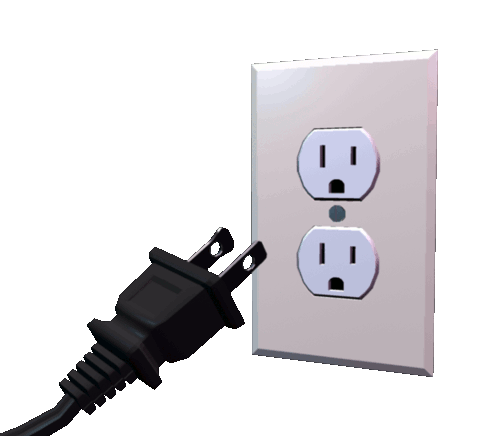

## Time to get your project started!

You should know the drill by now. But in case you forgotten the Node essentials...

```bash
$ mkdir your-project-name
$ cd your-project-name
$ npm init
```

When your package.json arrives, do yourself a favor and make sure it has these module dependencies.
Also, create an app.js while you're at it.

```bash
$ npm install express socket.io mongoose express-handlebars --s
$ touch app.js
```

Here's what your app.js should look like.

```javascript
//App.js
const express = require('express');
const app = express();
//Socket.io has to use the http server
const http = require('http').Server(app);

//Express View Engine for Handlebars
const exphbs  = require('express-handlebars');
app.engine('handlebars', exphbs());
app.set('view engine', 'handlebars');

app.get('/', (req, res) => {
  res.render('index.handlebars');
})

http.listen('3000', () => {
  console.log('Server listening on Port 3000');
})
```

If this code makes no sense, I recommend this [tutorial](https://www.makeschool.com/online-courses/tutorials/giphy-search-app-with-node-js/your-node-environment).

### Add in the views
If you tried running the server, you'll notice you haven't yet created index.handlebars.
Let's do that.

```bash
$ mkdir views
$ cd views
$ touch index.handlebars
$ cd ..
```

```html
<!--index.handlebars-->
<!DOCTYPE html>
<html>
  <head>
    <meta charset="utf-8">
    <title></title>
  </head>
  <body>
    <h1>Socket.io</h1>
  </body>
</html>
```

## Looking Pretty Good!
Time to put on your big kid gear, because you're now about to make your first socket.io connection!


