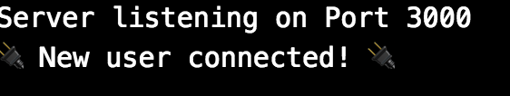

Let's just jump right in and get Socket.io working.

# Set up the Connection

Let's import socket.io in our `app.js`, and then open a connection and log that the connection opened.

>[action]
> Replace your current `app.js` code with the following:
>
```js
//app.js
const express = require('express');
const app = express();
const server = require('http').Server(app);
>
//Socket.io
const io = require('socket.io')(server);
io.on("connection", (socket) => {
  console.log("🔌 New user connected! 🔌");
})
>
const exphbs  = require('express-handlebars');
app.engine('handlebars', exphbs());
app.set('view engine', 'handlebars');
>
app.get('/', (req, res) => {
  res.render('index.handlebars');
})
>
server.listen('3000', () => {
  console.log('Server listening on Port 3000');
})
```

You have now successfully set up your backend for incoming socket connections!

# Take it to the Front End

Remember that we use Socket.io on both the server and client, so let's update our front end accordingly.

>[action]
> Create your `/public` folder with an `index.js`.
>
```bash
$ mkdir public
$ cd public
$ touch index.js
$ cd ..
```
>
>Make sure your `app.js` is using the public folder.
>
```js
//app.js
//Express View Engine for Handlebars
const exphbs  = require('express-handlebars');
app.engine('handlebars', exphbs());
app.set('view engine', 'handlebars');
//Establish your public folder
app.use('/public', express.static('public'))
```

The `socket.io` npm module automatically sets up a `/socket.io/socket.io.js` path in your project to the `socket.io` frontend JavaScript. So we can update our handlebars to require the client-side socket.io script.

>[action]
> Update your `/views/index.handlebars` file to the following:
>
```html
<!DOCTYPE html>
<html>
  <head>
    <meta charset="utf-8">
    <title>Make Chat</title>
    <script src="https://ajax.googleapis.com/ajax/libs/jquery/3.3.1/jquery.min.js"></script>
    <script src="socket.io/socket.io.js"></script>
    <script src="/public/index.js"></script>
  </head>
  <body>
    <h1>Socket.io</h1>
  </body>
</html>
```

You may notice we're also including `jQuery` to make the DOM manipulation a little easier. Feel free not to include it and use your vanilla `js` powers you've learned in other tutorials. For this tutorial though, we'll be using `jQuery`.

>[action]
>Finally add this code to `index.js`
>
```js
$(document).ready( () => {
  //Connect to the socket.io server
  const socket = io.connect();
})
```

Your app is now ready for realtime communications. Reload [http://localhost:3000/](http://localhost:3000/) and check your server logs on your terminal. You should seed the below logs:



# Now Commit

```bash
$ git add .
$ git commit -m 'Integrated Socket.io'
$ git push
```

# Great, but what happened?

Good question.

Currently, your `app.js` is listening for any incoming socket connections from the client.

The `io.on("connection")` is a special listener that fires whenever a new client connects. So, for example, in a chat room application, you could message everyone that a new user joined the chat room when this event fires.

```js
// app.js

io.on("connection", (socket) => {
  // Do something when a new socket(client) connection is formed
})
```

```js
// public/index.js

//Connect to the io(server)
const socket = io.connect();
```

## Makes enough sense

Great! We can now start building our chat application.

Let's have our users create a username!
