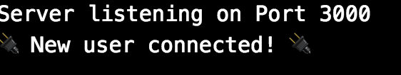

Let's just jump right in and get Socket.io working.

# Set up the Connection

Let's import socket.io in our app.js

```js
//app.js
const express = require('express');
const app = express();
const server = require('http').Server(app);

//Socket.io stuff
const io = require('socket.io')(server);
io.on("connection", (socket) => {
  console.log("🔌 New user connected! 🔌");
})

const exphbs  = require('express-handlebars');
app.engine('handlebars', exphbs());
app.set('view engine', 'handlebars');

app.get('/', (req, res) => {
  res.render('index.handlebars');
})

server.listen('3000', () => {
  console.log('Server listening on Port 3000');
})
```

You have now successfully set up your backend for incoming socket connections.
Open up your browser to http://localhost:3000/ to see the server log message *"New user connected!"*

What you don't see it? Did you remember to update your front end as well?

# Take it to the Front

Socket.io must be on both the server and client, so let's update accordingly.

Create your very own public folder with an index.js.

```bash
$ mkdir public
$ cd public
$ touch index.js
$ cd ..
```

Make sure your app.js is using the public folder.

```js
//app.js
//Express View Engine for Handlebars
const exphbs  = require('express-handlebars');
app.engine('handlebars', exphbs());
app.set('view engine', 'handlebars');
//Establish your public folder
app.use('/public', express.static('public'))
```

Now update your handlebars to use the client-side socket.io script.

```html
<!DOCTYPE html>
<html>
  <head>
    <meta charset="utf-8">
    <title>Make Chat</title>
    <script src="https://ajax.googleapis.com/ajax/libs/jquery/3.3.1/jquery.min.js"></script>
    <script src="socket.io/socket.io.js"></script>
    <script src="/public/index.js"></script>
  </head>
  <body>
    <h1>Socket.io</h1>
  </body>
</html>
```

As you notice, we're also including jquery to make the DOM manipulation a little easier. Feel free not to include it and use your vanilla js powers you've learned in other tutorials.

Finally add this code to `index.js`

```js
$(document).ready( () => {
  //Connect to the socket.io server
  const socket = io.connect();
})
```

Your app is now ready for realtime communications. Reload http://localhost:3000/ and check your server logs.



# Great, but what happened?

Good question.

Currently, your app.js is listening for any incoming socket connections from the client.

The *io.on("connection")* is a special listener that fires whenever a new client connects.

```js
io.on("connection", (socket) => {
  // Do something when a new socket(client) connection is formed
})
```

```js
//Connect to the io(server)
const socket = io.connect();
```

## Makes enough sense

Great! We can now start building our chat application.

Let's have our users create a username!
