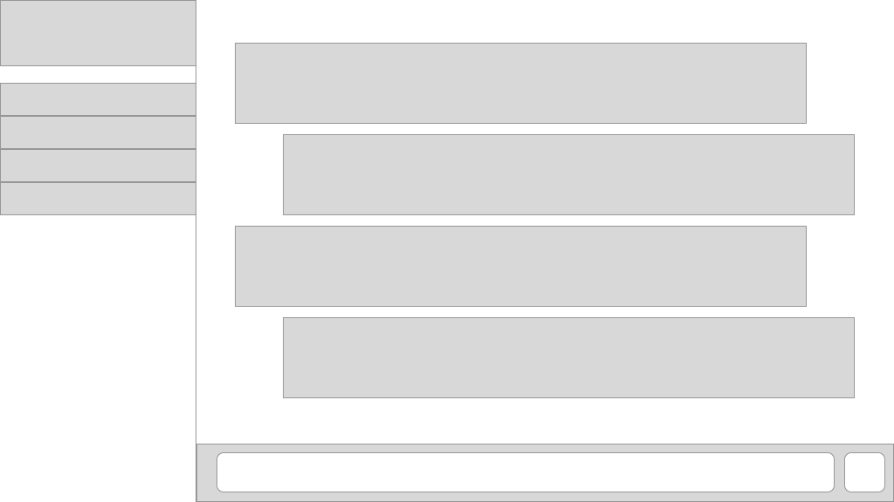

1. ~~Build out a basic view~~
1. ~~Integrate sockets~~
1. ~~Implement user form~~
1. **Style and send messages**
    1. **Implement the styles for the app**
    1. **Send messages using sockets**
    1. **Listen for messages using sockets**
1. Connect/disconnect users
1. Create/persist/join channels

## Make It Look Like Slack

Now that our server and client are ready for new users, lets update the look of our website.

Remember we want it to look roughly like this wireframe:



I'll give you the new handlebars and CSS so you can fast forward a bit on the styling.

>[action]
> Update your `/views/index.handleabars` to the following:
>
```html
<!--index.handlebars-->
<!DOCTYPE html>
<html>
  <head>
    <meta charset="utf-8">
    <title>Make Chat</title>
    <script src="https://ajax.googleapis.com/ajax/libs/jquery/3.3.1/jquery.min.js"></script>
    <script src="socket.io/socket.io.js"></script>
    <script src="/public/index.js"></script>
    <link href='https://cdnjs.cloudflare.com/ajax/libs/flexboxgrid/6.3.1/flexboxgrid.min.css'></link>
    <link href='/public/index.css' rel='stylesheet' type='text/css'></link>
  </head>
  <body>
>
    <form class="username-form">
      <input id="username-input" placeholder="Username"></input>
      <button id="create-user-btn">Join Chat</button>
    </form>
>
    <div class="main-container">
      <div class="channels-and-users-online-container">
        <h1 class="brand">Make Chat</h1>
        <div class="channels">
            <h2 class="channels-label">Channels</h2>
            <div class="new-channel-form"><input id="new-channel-input" placeholder="New Channel" /><button id="new-channel-btn">Create</button></div>
            <div class="channel-current">General</div>
        </div>
        <h2>Online Users</h2>
        <div class="users-online"></div>
      </div>
      <div class="chat-container">
        <div class="chat-container-fluid">
          <div class="message-container">
              <h2>Messages</h2>
          </div>
          <div class="text-chat-divide"></div>
          <div class="chat-box"><textarea id="chat-input" placeholder="Type a message"></textarea><button class="btn" id="send-chat-btn">Send</button></div>
        </div>
      </div>
    </div>
>
  </body>
</html>
```
>
> Update `/public/index.css` to the following:
>
```css
* {
  font-family: helvetica;
}
>
.username-form {
  display: flex;
  width: 50%;
  margin-left: auto;
  margin-right: auto;
  padding: 10px;
  flex-direction: column;
  justify-content: center;
  align-items: center;
}
>
#username-input {
  font-size: 20px;
  padding: 5px;
  margin-bottom: 5px;
  width: 100%;
}
>
#create-user-btn {
  width: 45%;
  font-size: 20px;
  font-weight: bold;
  padding: 5px;
}
>
.channels {
  display: flex;
  flex: 6;
  flex-direction: column;
  margin-right: 15px;
  overflow-y: auto;
  width: 100%;
}
>
.new-channel-form {
  display: flex;
  margin-top: -10px;
  margin-bottom: 10px;
  margin-left: 8px;
  margin-right: 8px;
}
>
#new-channel-input {
  font-size: 14px;
  width: 70%;
}
>
#new-channel-btn {
  font-size: 14px;
  width: 30%;
}
>
.channel {
  font-size: 18px;
  padding: 10px 0px;
  margin: 2px 0px;
  cursor: pointer;
}
>
.channel:hover {
  color: grey;
}
>
.channel-current {
  font-weight: bold;
  font-size: 18px;
  padding: 10px 0px;
  margin: 2px 0px;
  background-color: #4f9689;
}
>
.brand {
  margin-left: 8px;
}
>
.channels-label {
  margin-left: 8px;
}
>
.chat-container {
  width: 80%;
  display: flex;
  flex-direction: column;
  background-color: white;
}
>
.chat-container-fluid {
  margin: 8px;
  display: flex;
  flex-direction: column;
}
>
.channels-and-users-online-container {
  width: 20%;
  margin-left: -8px;
  margin-top: -8px;
  margin-right: 8px;
  display: flex;
  flex-direction: column;
  height: 750px;
  background-color: #4d394b;
  color: white;
}
>
.users-online {
  margin-left: 8px;
  display: flex;
  flex-direction: column;
  align-items: flex-start;
  justify-content: flex-start;
  overflow-y: auto;
  flex: 4;
}
>
.user-online {
  margin-bottom: 8px;
  font-size: 18px;
}
>
.text-chat-divide {
  border: 0.5px solid green;
  margin-bottom: 10px;
}
>
.chat-box {
  display: flex;
  justify-content: center;
  width: 100%;
}
>
label {
  display: block;
}
>
#chat-input {
  width: 100%;
  display: inline;
}
>
#send-chat-btn {
  width: 10%;
  display: inline;
}
>
.message-container {
  display: flex;
  margin-bottom: 10px;
  padding-bottom: 10px;
  flex-direction: column;
}
>
.message {
  margin-bottom: 5px;
}
>
.message-user {
  display: inline;
  color: red;
  font-weight: bold;
}
>
.message-text {
  display: inline;
}
>
.main-container {
  display: none;
  flex-direction: row;
  width: 100%;
}
```

Whew, that's a lot of boilerplate code. You may notice though that if you reload your browser, none of the styling appears. This is because if you check the last item in `/public/index.css`, you'll notice we _set the `display` of `.main-container` to `none`._ In the next section, we'll use jQuery to update the `display` to `flex`, and then you'll get to see your beautiful new app!

Before we go any further, let's commit what we have now:

# Now Commit

```bash
$ git add .
$ git commit -m 'Added styling for make chat'
$ git push
```

# Display Online Users

Let's update your `index.js` so it doesn't just log when someone joins the chat, but instead it displays their names in the "Online Users" section.

>[action]
> Replace all your code in `public/index.js` with the following code. Notice the line that uses the `.append()` function to append a new online user:
>
```javascript
//index.js
$(document).ready(()=>{
  const socket = io.connect();
>
  $('#create-user-btn').click((e)=>{
    e.preventDefault();
    if($('#username-input').val().length > 0){
      socket.emit('new user', $('#username-input').val());
      $('.username-form').remove();
      // Have the main page visible
      $('.main-container').css('display', 'flex');
    }
  });
>
  //socket listeners
  socket.on('new user', (username) => {
    console.log(`${username} has joined the chat`);
    // Add the new user to the online users div
    $('.users-online').append(`<div class="user-online">${username}</div>`);
  })
>
})
```

Now test everything again with two browsers. Enter a username and you should see the main content, as well as the online users.

# Let's send some messages

Look at the nice text area we have for sending messages. If only it worked...

Below we need to wire up the `#send-chat-btn` to **emit** a `new message` event to the server, and have the server **emit** a `new message` event to all connected clients. We can do this by achieving the following:

1. Saving the client's username to a `currentUser` variable.
1. Then make sure our send chat button **emits** `new message` to our server. Know that you can emit multiple pieces of data (such as `sender` and `message`)

**Update `/public/index.js` to make this happen!**

Try coding this on your own! If you get stuck, check the solution box below:

> [solution]
> Read the comments to help understand what each event is doing:
>
```javascript
//index.js
$(document).ready(()=>{
  const socket = io.connect();
>
  //Keep track of the current user
  let currentUser;
>
  $('#create-user-btn').click((e)=>{
    e.preventDefault();
    if($('#username-input').val().length > 0){
      socket.emit('new user', $('#username-input').val());
      // Save the current user when created
      currentUser = $('#username-input').val();
      $('.username-form').remove();
      $('.main-container').css('display', 'flex');
    }
  });
>
  $('#send-chat-btn').click((e) => {
    e.preventDefault();
    // Get the message text value
    let message = $('#chat-input').val();
    // Make sure it's not empty
    if(message.length > 0){
      // Emit the message with the current user to the server
      socket.emit('new message', {
        sender : currentUser,
        message : message,
      });
      $('#chat-input').val("");
    }
  });
>
  //socket listeners
  socket.on('new user', (username) => {
    console.log(`${username} has joined the chat`);
    $('.users-online').append(`<div class="user-online">${username}</div>`);
  })
>
})
```

Let's now create the `"new message"` listener on our server.

**Update `/sockets/chat.js` to allow for this! As before, try doing this on your own first!**

**Hint:** remember what you did for `new user`

>[solution]
>
```javascript
//chat.js
module.exports = (io, socket) => {
>
  socket.on('new user', (username) => {
    console.log(`✋ ${username} has joined the chat! ✋`);
    io.emit("new user", username);
  })
>
  //Listen for new messages
  socket.on('new message', (data) => {
    // Send that data back to ALL clients
    console.log(`🎤 ${data.sender}: ${data.message} 🎤`)
    io.emit('new message', data);
  })
>
}
```
> Notice how we can access the `data` sent like an object.

Finally we should update the client to listen for any `new message` events from the server, and when they come, append those new messages to the DOM for the user to see.

**You got this one! Give it a shot first! You'll be adding the code to `/public/index,js`**

>[solution]
> Add a `socket.on('new message')` listener to `/public/index,js`:
>
```javascript
...
>
//Output the new message
socket.on('new message', (data) => {
  $('.message-container').append(`
    <div class="message">
      <p class="message-user">${data.sender}: </p>
      <p class="message-text">${data.message}</p>
    </div>
  `);
})
```

Wow, what a lot of work. Reload your pages and see if the page updates for each message.

# Now Commit

```bash
$ git add .
$ git commit -m 'Users can join chat and send messages'
$ git push
```

# Great, we have users and chat! We're finished right?

Not so fast, Sonic.

If you were to reload or create a new instance in another tab, you will see that the online users and messages don't save.

This is because our application is currently only showing new data coming in. There is no system in place to show old data.

Also we don't even have different channels. How boring is that?

Let's move on!
